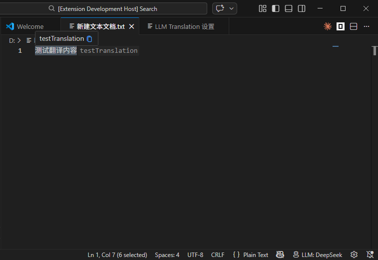
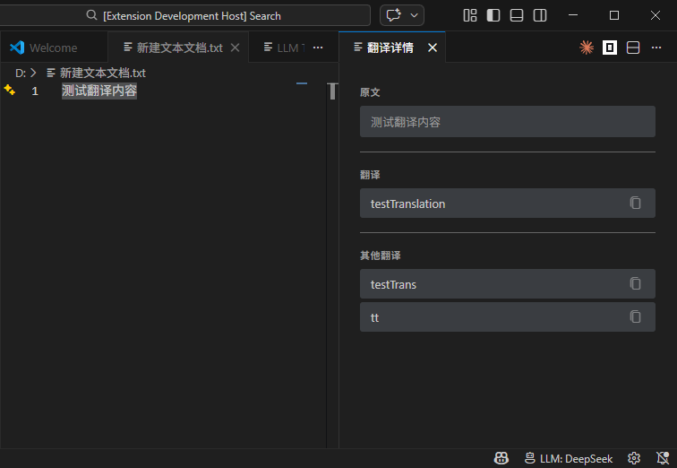
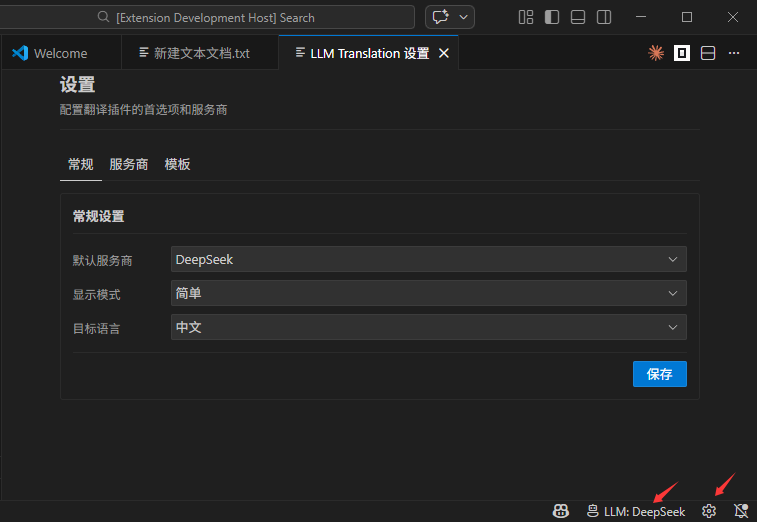
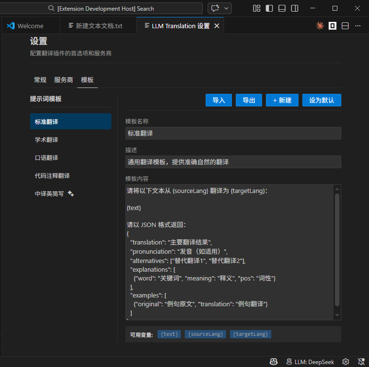

#  LLM Translation

<p align="center">
  
</p>

<p align="center">
  <a href="https://github.com/webPan/llm-translation/releases">
    
  </a>
  <a href="LICENSE">
    
  </a>
  
  
</p>

> **AI 驱动的 VS Code 翻译插件**，支持多种主流大语言模型，提供简洁高效的翻译体验。

[English](README_EN.md) | 简体中文

---

## ✨ 功能特性

| 特性 | 描述 |
|------|------|
| 🤖 **多 LLM 支持** | 支持 DeepSeek、阿里通义千问、月之暗面 Kimi、智谱 GLM 等主流大模型 |
| ⚡ **双模式显示** | 简版模式快速预览，完整模式展示详细翻译结果 |
| 🌍 **多语言翻译** | 支持中、英、日等多种语言互译 |
| 🔄 **翻译替换** | 一键将原文替换为翻译结果 |
| 📝 **自定义提示词** | 支持学术、代码、口语等多种翻译风格 |
| 🎨 **智能 UI** | 内联提示、悬停卡片、设置面板，操作便捷 |
| 🔐 **安全存储** | API Key 存储在 VS Code 密钥管理中 |
| 📊 **实时状态** | 状态栏显示当前使用的模型和翻译状态 |

---

## 📦 安装

### 方式一：VS Code 商店安装（推荐）

1. 打开 VS Code
2. 点击左侧扩展图标或按 `Ctrl+Shift+X`
3. 搜索 `LLM Translation`
4. 点击安装

### 方式二：手动安装

```bash
# 1. 下载最新 .vsix 文件
# 2. 在 VS Code 中按 Ctrl+Shift+P
# 3. 选择 "Extensions: Install from VSIX..."
# 4. 选择下载的文件
```

---

## 🚀 快速开始

### 1. 配置 API Key

打开 VS Code 设置（`Ctrl+,`），搜索 `LLM Translation`，配置至少一个服务商的 API Key：

```json
{
  "llmTranslation.providers.deepseek.apiKey": "sk-xxxxxxxx"
}
```

或使用命令：`Ctrl+Shift+P` → `LLM Translation: Set API Key`

### 2. 开始翻译

- 选中文本
- 右键 → `Translation`
- 或使用快捷键 `Ctrl+Shift+T`（Mac: `Cmd+Shift+T`）

---

## 🏗️ 支持的 LLM 服务商

| 服务商 | 模型 | 官网 |
|--------|------|------|
| **DeepSeek** | deepseek-chat | [platform.deepseek.com](https://platform.deepseek.com) |
| **通义千问** | qwen-turbo, qwen-plus | [dashscope.aliyun.com](https://dashscope.aliyun.com) |
| **Kimi** | moonshot-v1-8k | [platform.moonshot.cn](https://platform.moonshot.cn) |
| **智谱 GLM** | glm-4 | [open.bigmodel.cn](https://open.bigmodel.cn) |

---

## ⚙️ 详细配置

### API Key 设置

```json
{
  "llmTranslation.providers.deepseek.apiKey": "your-api-key",
  "llmTranslation.providers.deepseek.model": "deepseek-chat",
  "llmTranslation.providers.deepseek.baseUrl": "https://api.deepseek.com",

  "llmTranslation.providers.qwen.apiKey": "your-api-key",
  "llmTranslation.providers.qwen.model": "qwen-turbo",

  "llmTranslation.providers.kimi.apiKey": "your-api-key",
  "llmTranslation.providers.kimi.model": "moonshot-v1-8k",

  "llmTranslation.providers.glm.apiKey": "your-api-key",
  "llmTranslation.providers.glm.model": "glm-4"
}
```

### 默认设置

```json
{
  // 默认翻译服务商
  "llmTranslation.defaultProvider": "deepseek",
  
  // 默认目标语言: auto(自动检测), zh(中文), en(英文), ja(日文)
  // auto 模式：中文自动翻译成英文，英文自动翻译成中文
  "llmTranslation.defaultTargetLang": "auto",
  
  // 显示模式: simple(简版), normal(完整)
  "llmTranslation.displayMode": "simple"
}
```

### 简版模式设置

```json
{
  "llmTranslation.simpleMode.autoHide": true,
  "llmTranslation.simpleMode.autoHideDelay": 300,
  "llmTranslation.simpleMode.showPronunciation": false,
  "llmTranslation.simpleMode.showAlternatives": true,
  "llmTranslation.simpleMode.maxAlternatives": 2
}
```

### 提示词模板

```json
{
  // 默认模板: default, academic, casual, code, abbreviation
  "llmTranslation.defaultPromptTemplate": "default",
  
  // 自定义模板
  "llmTranslation.customPromptTemplates": [
    {
      "name": "商务正式",
      "description": "商务邮件正式翻译",
      "template": "请将以下内容翻译成正式商务风格的{targetLang}，保持专业语气：\n\n{text}"
    }
  ]
}
```

---

## ⌨️ 快捷键

| 快捷键 | Windows/Linux | Mac | 功能 |
|--------|--------------|-----|------|
| 翻译选中文本 | `Ctrl+Shift+T` | `Cmd+Shift+T` | 翻译当前选中的文本 |

> 💡 可在 VS Code 键盘快捷键设置中自定义

---

## 📋 命令列表

按 `Ctrl+Shift+P` 打开命令面板，搜索 `LLM Translation`：

| 命令 | 描述 |
|------|------|
| `Translation` | 翻译选中文本（根据当前模式） |
| `Translate (Simple Mode)` | 使用简版模式翻译 |
| `Translate (Full Mode)` | 使用完整模式翻译 |
| `Translate to English` | 翻译为英语 |
| `Translate to Chinese` | 翻译为中文 |
| `Translate to Japanese` | 翻译为日语 |
| `Translate and Replace` | 翻译并替换原文 |
| `Switch Provider` | 切换 LLM 服务商 |
| `Toggle Display Mode` | 切换显示模式 |
| `Open Settings` | 打开设置页面 |
| `Set API Key` | 设置 API Key |

---

## 🖼️ 使用演示

### 简版模式
> 选中文本后快速显示翻译结果，自动隐藏



### 完整模式
> 在面板中显示详细翻译结果、发音、备选翻译



### 设置面板
> 可视化配置 API Key 和各项参数



### 提示词设置
> 可自定义提示词模板



---

## 🏛️ 技术架构

```
┌─────────────────────────────────────────────────────────┐
│                    VS Code Extension                     │
│  ┌──────────────┐  ┌──────────────┐  ┌──────────────┐  │
│  │   Commands   │  │   Services   │  │   Webview    │  │
│  │  (翻译命令)   │  │ (状态栏/内联) │  │ (设置面板)    │  │
│  └──────┬───────┘  └──────┬───────┘  └──────────────┘  │
│         │                 │                             │
│  ┌──────▼─────────────────▼───────┐                     │
│  │       BaseProvider            │                     │
│  │     (通用 HTTP/错误处理)       │                     │
│  └──────┬──────────┬─────────────┘                     │
│         │          │          │                         │
│  ┌──────▼───┐ ┌────▼───┐ ┌────▼───┐ ┌────▼───┐        │
│  │ DeepSeek │ │  Kimi  │ │  Qwen  │ │  GLM   │        │
│  │ Provider │ │Provider│ │Provider│ │Provider│        │
│  └──────────┘ └────────┘ └────────┘ └────────┘        │
└─────────────────────────────────────────────────────────┘
                           │
                           ▼
                    ┌──────────────┐
                    │  LLM APIs    │
                    └──────────────┘
```

---

## 🤝 贡献指南

欢迎提交 Issue 和 PR！

### 开发环境

```bash
# 1. 克隆项目
git clone https://github.com/webPan/llm-translation
cd llm-translation

# 2. 安装依赖
npm install

# 3. 启动调试
npm run watch
# 按 F5 启动 Extension Host
```

### 项目结构

```
src/
├── commands/          # 命令实现
├── providers/         # LLM 服务商封装
├── services/          # 业务服务（状态栏、内联显示等）
├── types/             # TypeScript 类型定义
├── webview/           # WebView 面板组件
└── extension.ts       # 插件入口
```

### 提交规范

- `feat:` 新功能
- `fix:` 修复问题
- `docs:` 文档更新
- `refactor:` 代码重构
- `chore:` 构建/工具更新

---

## 📜 许可证

[MIT](LICENSE) © 2024 LLM Translation Contributors

---

## 🙏 致谢

- [DeepSeek](https://deepseek.com/) - 提供优秀的大语言模型
- [VS Code](https://code.visualstudio.com/) - 强大的编辑器平台
- 所有开源贡献者

---

<p align="center">
  ⭐ 如果这个项目对你有帮助，请给它一个 Star！
</p>
